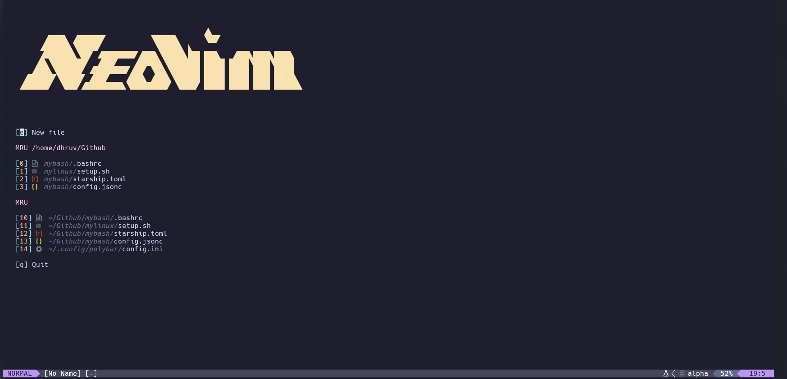

**Project Overview**

This project aims to create a personal Neovim configuration that can be seamlessly used on both Windows and Linux platforms. The goal is to have a consistent and efficient editing experience across different operating systems.

**Screenshot**

